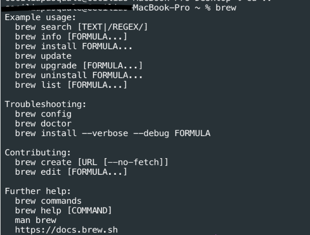

## Install Using A Package Manager
A package manager is a command line tool that allows you to install and manage software. You can use a package manager to install all of the software listed here.

The package manager that we'll be using for this guide is called Homebrew. It's a command-line installer for MacOS, which means that you'll have to be running a macOS in order to use. The examples provided here are utilizing macvscodeOS Catalina version 10.15.5.

### Step 1: Install Homebrew

Then open your terminal and type brew.

The result should look like the following:

## Step 2: Install Git
With Homebrew installed, you are now ready to install Git. Open a terminal window and enter `brew install git`

To verify that Git is installed on your system, type `git --version`
