# Install Java

1. Navigate in your web browser to [Oracle's JDK 11](https://www.oracle.com/java/technologies/javase-jdk11-downloads.html) website. 

2. In the top right of the website click "View Accounts" and then "Create an Account." (If you already have an Oracle account you can just skip to step 5)

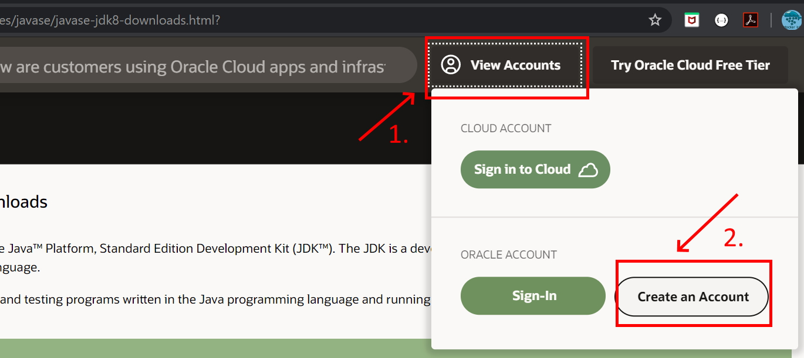

3. Fill in the form with your information (you may type "none" for Company Name) and then click the "Create Account" button. 

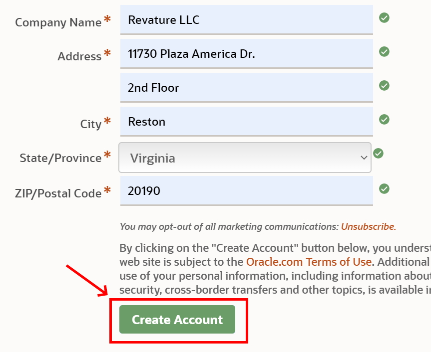

4. Check your e-mail account for a new message from Oracle. (This may take a few minutes.) When you receive the e-mail open it and click the "Verify Email Address" button inside. This should direct you to a success screen. 

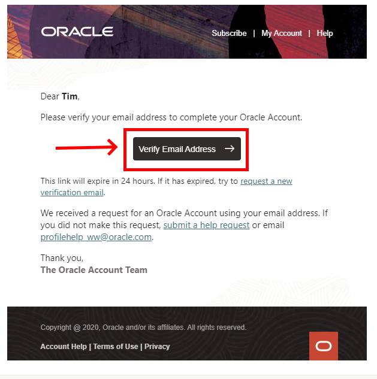

5. Return to [Oracle's JDK 11](https://www.oracle.com/java/technologies/javase-jdk11-downloads.html) website. Scroll to find the appropriate JDK for your Operating System and Architecture. (For Mac or Windows- be sure and select the installer as shown below) and click to download. 

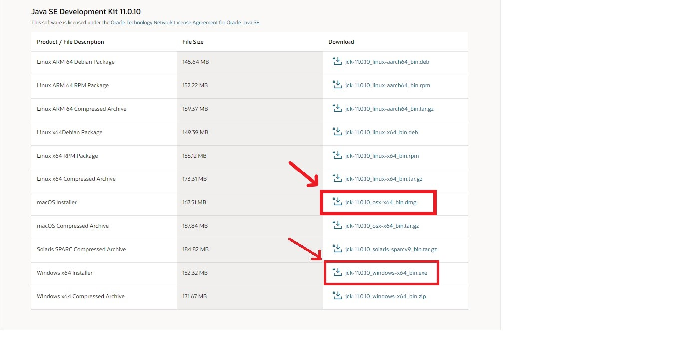

6. A popup will ask you to review the license before continuing. Do so and click the check box and then the download button.

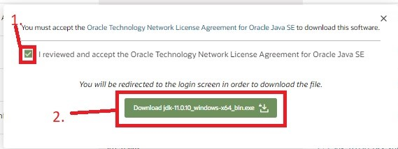

7. Once the download is complete, click the file that downloads in your browser to open it and skip to step 10. If you do not see the file in your browser then proceed to step 8 to find it in your downloads folder. 

8. If you could not open the JDK installer from your browser open your file explorer or Finder. (Windows image shown below.) 

9. In the window that opens click the "Downloads" folder, search (in the top right- Windows) for "jdk" and double click the jdk installer.(Windows image shown below.)

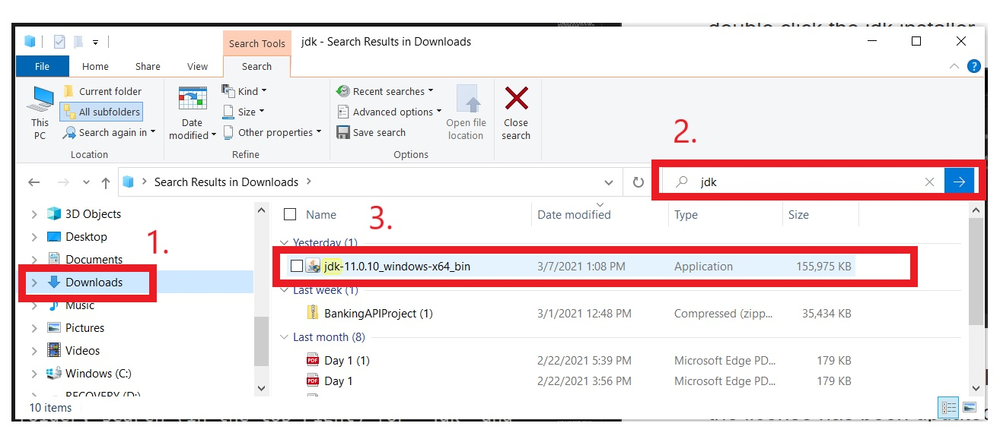

10. The installer will begin with a welcome message. Simply click Next to continue.

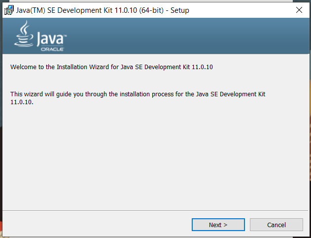

11. The installer will continue and you should just accept the default setup. **IMPORTANT: Make note of the file path for the installation directory if you are on Windows! You WILL need this later. Click "Next."**

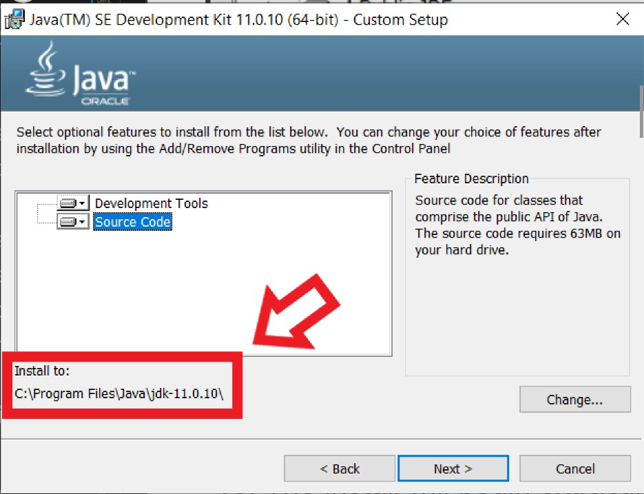

12. The install will begin extracting files and may ask to confirm the installation directory of the JRE. 

14. Java will finish installing and you can then click "Close." You should see the following success message.

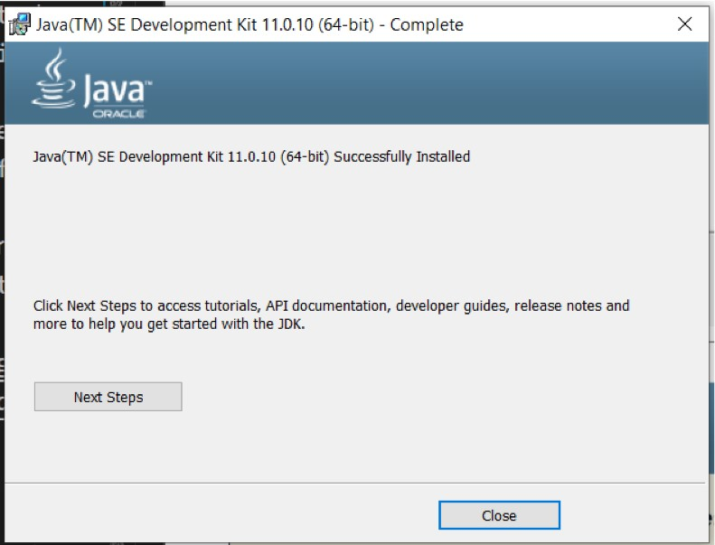

> Mac users- your work is nearly complete. Skip to step 22. Windows users continue on.

15. Use your system search tool (next to the windows button) to look for "Edit the system environment variables" in the control panel. Be sure that you open the SYSTEM environment not the ones just for your account. 

16. Click the "Environment Variables" button in the window that opens.

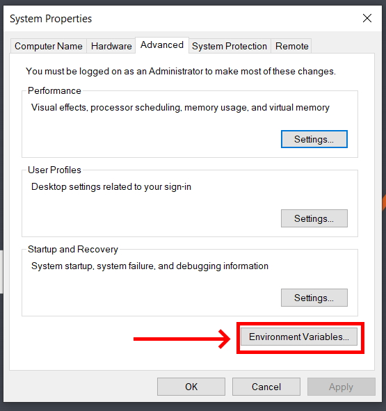

17. Under "System Variables" click the "New" button. 

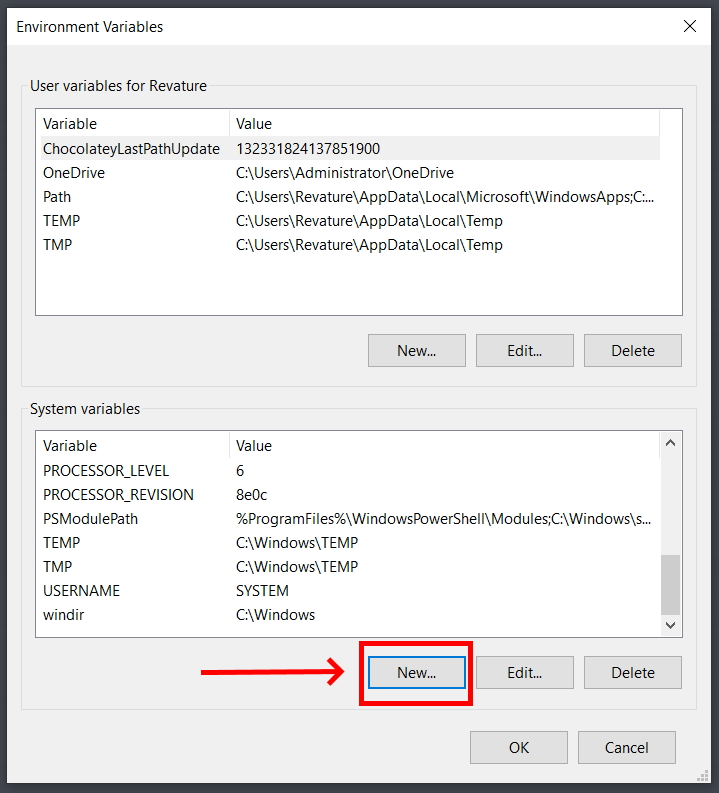

18. Name the new variable "JAVA_HOME" and give it the value of the directory where your JDK was installed to. (See Step 12.) If you are unsure of your directory path you can go to C:\Program Files\Java in your file explorer then click on the JDK folder to open it. You can then copy the path from the navigation bar at the top of the file explorer. 

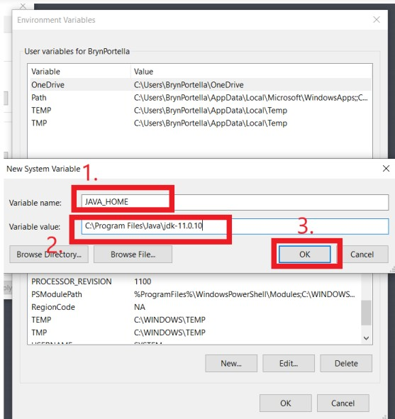

19. In your system variables then select the "Path" variable and click "Edit."

20. Click "New" to create a new line. Add the path to the JDK bin folder in this line, it will be "%JAVA_HOME%\\bin". 

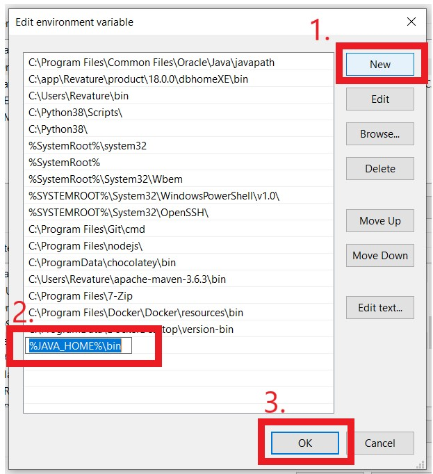

21. Click "OK" to close the Environment Variables window. 

22. Open Git Bash, type "java -version" and hit Enter. If the JDK is installed correctly you should see Java with the version number you downloaded. 

